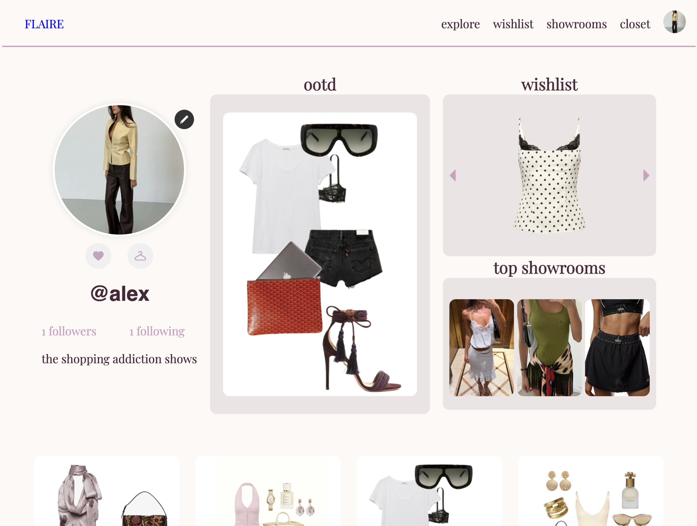
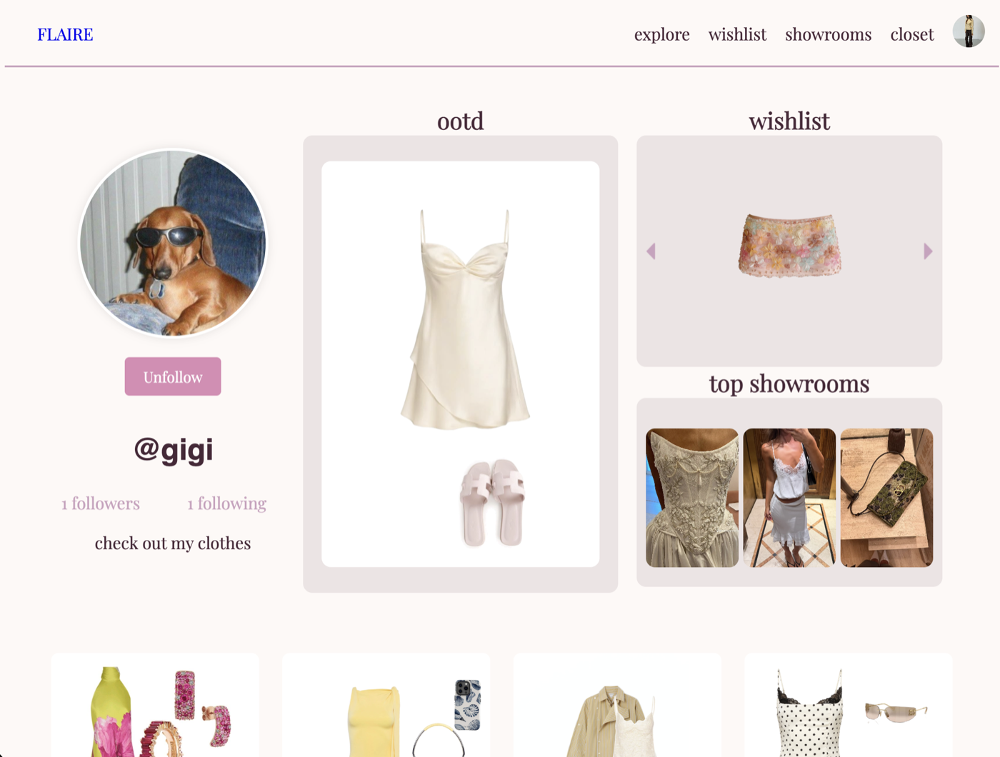

# FLAIRE: Fashion Social Platform

A virtual wardrobe and fashion social app. Upload your clothes, mix and match them in a drag-and-drop outfit builder, curate showrooms with collaborators, and like, comment on and follow other people's outfits. Built by a 5-person team for CSCI 42 (Software Engineering) at Ateneo de Manila University, Mar–May 2025.



**Stack:** Django · PostgreSQL · JavaScript · HTML/CSS<br>
**Upstream repo:** [ninasandejas/FLAIRE_CSCI42](https://github.com/ninasandejas/FLAIRE_CSCI42)

## My contributions

I owned the **user profile**: the profile page and its widgets, the logged-in vs. other-user views, and the edit-profile and customize-widget modals (25 commits, `user_management` app):

- **Follow / unfollow** and **follower & following lists**, with counts and a modal to browse them ([daaf2f6](https://github.com/ninasandejas/FLAIRE_CSCI42/commit/daaf2f6), [b5bc423](https://github.com/ninasandejas/FLAIRE_CSCI42/commit/b5bc423))
- **Public profile pages** for other users ([8584ffb](https://github.com/ninasandejas/FLAIRE_CSCI42/commit/8584ffb))
- **Edit-profile modal** ([8e5060f](https://github.com/ninasandejas/FLAIRE_CSCI42/commit/8e5060f), [aa11dfc](https://github.com/ninasandejas/FLAIRE_CSCI42/commit/aa11dfc))
- **Profile widgets:** outfit of the day with a selector, wishlist, and showrooms, linked to the rest of the app ([7a92129](https://github.com/ninasandejas/FLAIRE_CSCI42/commit/7a92129), [62a3c5d](https://github.com/ninasandejas/FLAIRE_CSCI42/commit/62a3c5d), [64942a4](https://github.com/ninasandejas/FLAIRE_CSCI42/commit/64942a4))
- Moved inline scripts into modules (`static/js/user_management/`), merged my feature branch into `main` and resolved the merge conflicts



[All my commits →](https://github.com/ninasandejas/FLAIRE_CSCI42/commits/main?author=gigigar)

My features passed the team's acceptance tests for editing a profile, profile widgets, and viewing other users' profiles (3 of the project's 15 requirement test cases).

## What we learned

From the team retrospective, the three lessons I'd apply to any shared codebase:

- **Plan around dependencies, not just features.** We split work by Django app, assuming features were self-contained. They weren't: tasks scheduled in parallel depended on each other's logic, so people had to revisit finished work.
- **Commit small and often.** Big late-stage commits made merges painful (I resolved several) and hid how long each feature had really been in progress.
- **Own the migration history.** Several of us generated Django migrations from the same `main` at once, and they fell out of sync. Fixing that during the final merges is how we actually learned how migrations work.

## Run it locally

Requires Python 3 and PostgreSQL.

```bash
python -m venv .venv && source .venv/bin/activate
pip install -r requirements.txt python-dotenv
cat > flaire/.env <<'ENV'
SECRET_KEY=dev-only-change-me
DB_NAME=flaire_database
DB_USER=postgres
DB_PASSWORD=postgres
TINIFY_API_KEY=   # optional, for image compression
ENV
cd flaire && python manage.py migrate && python manage.py runserver
```

## Team

[@ZoeOngkiko](https://github.com/ZoeOngkiko) · [@heartmethody13](https://github.com/heartmethody13) · [@ninasandejas](https://github.com/ninasandejas) · [@taffee-techs](https://github.com/taffee-techs) · [@gigigar](https://github.com/gigigar) <!-- swap handles for real names if teammates are OK with it -->

_Class project: not deployed. Tested with 15 manual requirement test cases, no automated tests._
